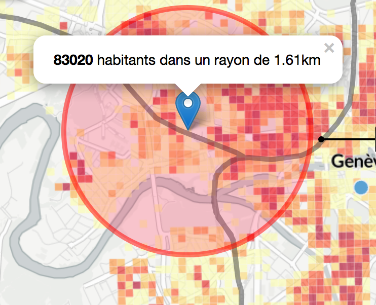
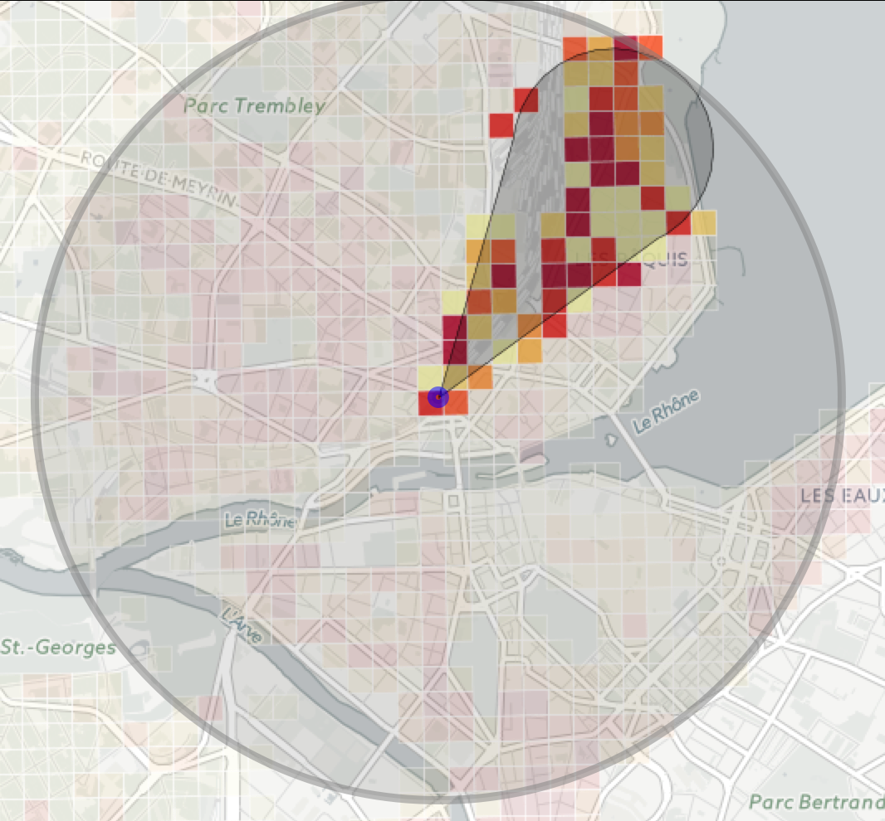

autoscale: true 
build-lists: true
footer: EBU, Geneva - 6/7 Oct. 2015
# EBU DevCon 2015<br><br>

## Data-journalism @ RTS-Info<br><br>
### a technical approach


---
# Agenda<br><br>

- Landscape of data-journalism @ RTS-Info
- Thoughts and feedback 
- Short case study
- Q&A 

---

# Landscape @ RTS-Info

Tools commonly used by journalists @ RTS:

- Tableau (a lot): easily produces exportable graphs
- Excel (a lot), and maybe will use it even more 
- CartoDB / MapBox / Google Maps
- Social tools: Twitter, Facebook, Instagram, Vine ...
- Web scraping: A lot, too much actually
- Elbow grease and infinite patience

^ Tableau offers many 
^ Office 2016 connectivity options

---

# Landscape @ RTS-Info

- No data repositories
- No code either 
- Not sharing data amongst teams
- Really aware of their "weaknesses" and trying to make things evolve

---

# It's about data...

- You must speak APIs fluently (Social, OAuth, Streaming APIs, REST, JSON, and even SOAP sometimes, if you're out of luck)
- SQL is not optional
- Don't get it wrong: it's **"not-so-big-data"** ...
- You'll code, eventually
- But you'll spent 80-90% of the time shaping and nurtering your precious data
- You may have to do tedious stuffs (scrapping, erk)

---


# What about this "agile" thing?

- Individuals and interactions over processes and tools: **Done!**
- Working software over comprehensive documentation: **that's your job, dude!**
- Customer collaboration over contract negotiation - 
- Responding to change over following a plan: a second nature for the journalists I've been working with
- **(partial) conclusion**: use agility for software if you want to, but it seems that most journalists already got the idea (w/ no post-it needed)

^ test

---


# Mobile first, really ?

- Providing an enjoyable "viz" experience on mobile is *possible*...
- But not in the same form as on desktop
- It's an entirely different approach/experience/project...
- ... with an entirely different budget
- Presenting data on small devices comes at a price !

---

# What's working ?
### (Or at least worked well @ RTS)

- Small teams
- One or more journalists
- One or more developers
- One (optional) design/UI/UX guy 
- Same physical workplace / proximity

---

# What's missing ?
### Remember:
####- journalists are not devs
####- devs are not journalists 

Journalists need help for things like:

- JS / D3js / REST / Geo services development
- Data definition, storage and sharing
- Real-time event tracking (Social, Geo) 
- Optionally: "Responsive" stuffs 

---

#Short case study: 
#"Chlorine train"

A story by:
- @RTS_Felix
- @ValentinTombez


See it live on RTS-Info: [http://bit.ly/1JH94wW](http://bit.ly/1JH94wW)


^ Rationale

---

# Technical stack 
## Data processing 

- Clojure + Incanter (Text/CSV/XLS processing, data formatting for export)
- PostgreSQL + PostGIS + SQL
- Google Geo APIs
- Opendata: BFS
- QGis

^ At this point, data or result is important, not the stack used

---

# Technical stack 
## UI and Server 

- Clojure + Compojure
- PostgreSQL + PostGIS
- CartoDB + OpenStreetMap
- Leaflet
- Flot for jQuery
- Google Geo APIs

---


# The reasons why

- Why not Python ? Mainly to use same tools/language for data processing and services
- Clojure: because it's (fun)
- Incanter: the iPython wannabe
- Because data is what you're producing, do it your way (no rules there)
- QGis: great tool, local: avoids web latency and visualize geo forms

---
# Some tips

- Clojure is **JVM** based, not black magic based: tune your JVM (-Xmx rings a bell?)
- Micro WS: use **composable**, small REST services
- For micro-services, use embedded and in-memory database (SQLite, H2, even **text data** are good candidates)
- Package as a simple executable (then Nginx it and Varnish it if you need so)
- (reasonably) bypassing Google API rate limit: you do know that you can create as many API keys as you need, right ?
- Cloud is there for a reason: AWS, S3, Azure, don't bother maintaining on-premise servers...
- Except for GIS stuffs, in some cases

---


# GIS Databases

- "Traditional" RDBMS + geographic extensions
- Geo data conversions are possible manually (*CH1903 -> WGS84*)
- But why bother when **PostGIS** does the job perfectly ?
- Moreover, the CartoDB backend is based on ... **PostGIS**
- You can work on a local GIS platform and export SQL results as dumps on CartoDB (just great!)
- For micro-services, it is even possibe to embed your GIS data (**SpatiaLite** for instance)

^ Mention MongoDB, Spatialite

---

# The PostGIS way 

Get all density points in a given radius (in meters:)

```SQL
SELECT sum(density) 
FROM chlorine_train.density_items_2500 
WHERE ST_Distance_Sphere(
the_geom, 
ST_MakePoint(7.0697021484375, 46.10561307998295)) 
<= 1610
```

or you can try Haversine formula

---

# The PostGIS way 

Try to guess ?

```SQL
SELECT 
st_makepolygon(
st_curvetoline(
st_transform(ST_GeomFromText(
'SRID=21781;COMPOUNDCURVE(
CIRCULARSTRING(500893 118570, 501293 118170,
 500893 117770), 
 (500893 117770, 499683 118170) , 
 (499683 118170, 500893 118570))'), 
 4326) ) )
AS drop
```
And try to transpose it (say, in JS)

---

# D3js and others

D3js is: 

- cool 
- a great **tool** for dataviz
- perfect for crafting highly customized visualisations
- but can be hard to use for non-devs
- lacks simple "out of the box" charts, so why not... 
- Google charts
- amcharts
- ...
 
---

# Beyond scrapping
## is hacking

Mobile apps are poorly protected regarding their API accesses, so one can easily:

- grab the binaries of an app (ask Google, gently)
- disassemble and reverse-engineer code
- seek for HTTP lib and API keys in clear code
- Free-lunch and open bar !

Avoids hours of tedious web scrapping, but is:
- not always possible
- a little bit "black hat", but sometimes a mean to an end

---

# Q&A

If time allows...

---


# Thank you !<br><br>

###fred@ikarius.com
#### @ikarius


---
#Sources 

- Agile manifesto [http://www.agilemanifesto.org](http://www.agilemanifesto.org)
- Train de chlore [http://bit.ly/1JH94wW](http://bit.ly/1JH94wW)
- BFS [http://www.bfs.admin.ch](http://www.bfs.admin.ch)
- Clojure [http://clojure.org](http://clojure.org)
- Incanter [http://clojure.org](http://clojure.org)
- QGis [http://qgis.org](http://qgis.org)
- PostGIS [http://postgis.net](http://postgis.net)


